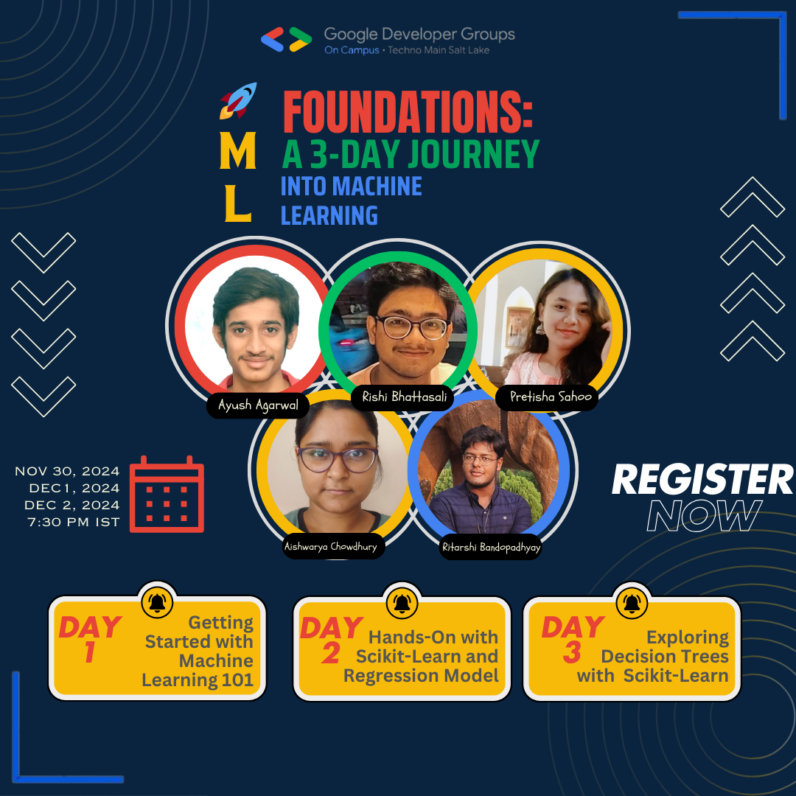

# ML Foundations: A 3-Day Journey into Machine Learning 🚀  



Welcome to the repository for the **ML Foundations: A 3-Day Journey into Machine Learning** series! This 3-day workshop is designed to take you from the basics of Machine Learning to advanced concepts, featuring hands-on sessions and practical implementations.

---

## 📅 Event Schedule  

### Day 1: **Getting Started with Machine Learning 101**  
- **Date:** 30th November  
- **Topic:** Introduction to ML concepts, types, and workflows.  
- **Key Learnings:**  
  - Fundamentals of Machine Learning  
  - Overfitting, underfitting, and ML types (supervised, unsupervised, reinforcement learning).  
  - ML Workflow: From data preprocessing to model evaluation.  

---

### Day 2: **Hands-On with Scikit-Learn and Regression Models**  
- **Date:** 1st December  
- **Topic:** Practical implementation of regression techniques using Python libraries.  
- **Key Learnings:**  
  - Introduction to Python libraries: Scikit-Learn, NumPy, and Pandas.  
  - Implementation of linear and logistic regression.  

📁 Project Code: Available in the `Day2 - ProjectCode/` directory.  

---

### Day 3: **Exploring Decision Trees with Scikit-Learn and EDA**  
- **Date:** 2nd December  
- **Topic:** Advanced ML techniques with decision trees and data preprocessing.  
- **Key Learnings:**  
  - Hands-on implementation of decision trees using Scikit-Learn.  
  - Exploratory Data Analysis (EDA) for data handling and preprocessing.  

📁 Project Code: Available in the `Day3 - ProjectCode/` directory.  

---

## 📂 Repository Structure  

```plaintext
ML-Foundations/
├── Day2 - ProjectCode/       # Project files for Day 2
├── Day3 - ProjectCode/       # Project files for Day 3
├── LICENSE                   # License information
├── PPT.pdf                   # Workshop presentation slides
└── README.md                 # This README file
```

---

## 📹 Workshop Recording  

Catch up on the complete workshop here:  

🔗 [Watch the Recording on YouTube](https://youtu.be/CdbU_IxCVjU)


---

## 🎯 Objectives  

By the end of this workshop series, participants will:  
- Understand the fundamental concepts of Machine Learning.  
- Gain practical experience with popular Python libraries like Scikit-Learn, NumPy, and Pandas.  
- Learn to build and evaluate ML models including regression and decision trees.  
- Enhance data handling skills using Exploratory Data Analysis (EDA).  

---

## 💻 How to Use This Repository  

1. **Clone the Repository:**  
   ```bash
   git clone https://github.com/GDG-OnCampusTMSL/ML-Foundations.git
   ```
2. Navigate to the respective directories (`Day2 - ProjectCode/` or `Day3 - ProjectCode/`) for project files.  
3. Open the `PPT.pdf` for reference to the presentation slides.  
4. Modify and run the code files to explore the implementations further.  

---

## 📧 Contact  

For any queries or feedback, feel free to reach out:  
- **GDG On-Campus TMSL**  
- Email: [gdsctechnomainsaltlake@gmail.com](mailto:gdsctechnomainsaltlake@gmail.com)  
- Website: [https://gdg.community.dev/gdg-on-campus-techno-main-salt-lake-kolkata-india/](https://gdg.community.dev/gdg-on-campus-techno-main-salt-lake-kolkata-india/)  

---

🚀 **Kickstart your journey into Machine Learning and build real-world problem-solving skills!**
